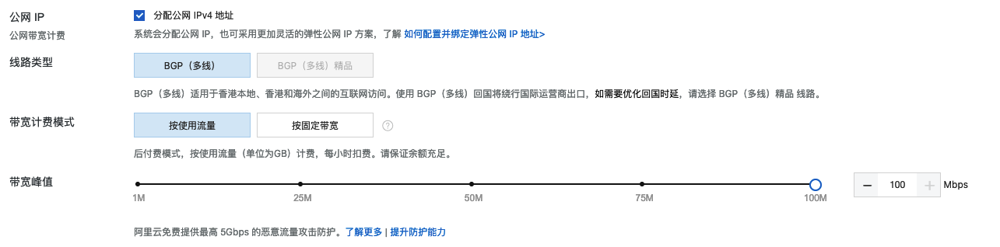

# AOPlatform-Community 部署指南（以阿里云为例）

## 组件概览

| 服务组件            | 用途             | 安装方式       | 运行方式  | 网络端口                                  |
| ------------------- | ---------------- | -------------- | --------- | ----------------------------------------- |
| docker              | 容器运行时       | rpm/deb        | systemd   | -                                         |
| aoplatform-mysql    | 关系型数据库     | docker-compose | container | -                                     |
| aoplatform-redis    | 非关系型数据库   | docker-compose | container | -                                   |
| aoplatform-proxy    | 网络规则代理服务 | docker-compose | container | 127.0.0.1:61011/tcp                       |
| aonetwork-server    | 网络隧道服务     | docker-compose | container | 127.0.0.1:61012/tcp, 0.0.0.0:61012/udp |
| aoplatform-base | 平台服务         | docker-compose | container | 127.0.0.1:61013/tcp                       |
| aoplatform-nginx    | 路由服务         | docker-compose | container | 0.0.0.0:80/tcp, 0.0.0.0:443/tcp            |

## 准备工作

- 准备域名。
  - 访问 <https://wanwang.aliyun.com> 购买域名 aospace.cn，本文以 aospace.cn 作为域名示例，用户可根据需要自行购买域名。
  - 相关支持文档请访问：<https://help.aliyun.com/document_detail/57266.html>

- 准备云虚机。

  - 访问 <https://ecs-buy.aliyun.com> 购买云虚机。

  - 相关支持文档请访问：<https://help.aliyun.com/product/25365.html。>

  - 地域和可用区建议就近选择，如域名未备案需选择中国香港地域或海外地域。

    

  - 实例规格最低需选择计算型 4 vCPU + 8 GiB 内存。

    

  - 镜像可以选择常见的 Linux 操作系统，这里我们以 Ubuntu 22.04 版本为例。

    

  - 存储可以根据自己需求选择，这里我们推荐 120G 及以上。

    

  - 公网 IP 需要勾选，我们这里选择按流量计费，带宽峰值会影响 Network-Tunnel 转发速度，可根据需求选择。

    

  - 安全组设置中需要开放 80/tcp、443/tcp、61012/tcp、61012/udp 端口，由于需要 SSH 访问，需要开放 22/tcp 端口，开放的 22/tcp 端口建议仅白名单 IP 地址访问。

    

  - 登录凭证可根据需要选择密钥对登录或自定义密码登录。

    

  - 实例名称与主机名可根据需要填写。

    

  - 检查完成后创建实例。

    

  - 访问控制台 <https://ecs.console.aliyun.com> 查看已创建的机器为运行中。同时记录下机器的公共 IP 地址。

    

- 准备 DNS 解析

  - 访问域名解析控制台 <https://dns.console.aliyun.com> 并找到对应购买的域名。

    

  - 添加 DNS 解析。

    - 主机记录 @，记录类型 A，记录值为购买的云虚机公共 IP 地址。

      

    - 主机记录 *，记录类型 A，记录值为购买的云虚机公共 IP 地址。

      

      - 添加完成后记录显示如下。

        

## 服务部署

### 容器运行时安装

- SSH 连接已购买的虚拟机。

  

- 由于我们购买的云虚机操作系统为 Ubuntu 22.04 ，安装 Docker 使用如下命令。

  ```bash
  curl -sSL https://get.docker.com | sh
  ```

  

- 设置 docker 开机自启并启动 docker。

  ```bash
  systemctl enable --now docker
  ```

- 安装 docker-compose

  ```bash
  curl -SL https://github.com/docker/compose/releases/download/v2.14.2/docker-compose-`uname -s`-`uname -m` > /usr/local/bin/docker-compose
  chmod +x /usr/local/bin/docker-compose
  ```

  如在国内主机安装访问 Github 网络异常可使用以下方式安装。

  ```bash
  curl -L https://get.daocloud.io/docker/compose/releases/download/v2.14.2/docker-compose-`uname -s`-`uname -m` > /usr/local/bin/docker-compose
  chmod +x /usr/local/bin/docker-compose
  ```

### 获取域名泛域名证书

使用开源工具获取开源 SSL 证书。

- 创建 acme 客户端 token。

  - -m 后面请使用自己的邮箱，用来接收 SSL 到期通知，以此方式申请的 SSL 证书有效期为三个月（90 天）。

  ```bash
  docker run --rm -v $PWD/data/acme.sh/:/acme.sh/ neilpang/acme.sh --register-account -m service@ao.space
  ```

  

- 申请泛域名证书 DNS 配置项。

  - 我们购买的域名为 `aospace.cn` 需要申请的 SSL 泛域名为 `*.aospace.cn` `*.res.aospace.cn` `*.upload.aospace.cn` `*.download.aospace.cn` `*.push.aospace.cn` `*.platform.aospace.cn`

    ```bash
    docker run --rm -v $PWD/data/acme.sh/:/acme.sh/ neilpang/acme.sh --issue --dns -d aospace.cn -d *.aospace.cn -d *.res.aospace.cn -d *.upload.aospace.cn -d *.download.aospace.cn -d *.push.aospace.cn -d *.platform.aospace.cn --yes-I-know-dns-manual-mode-enough-go-ahead-please -k 2048
    ```

    

  - 将返回的 TXT record 添加到 DNS 解析配置中。

    

  - 获取 SSL 证书。

    - 与申请 DNS 命令差异为 `--renew`

    ```bash
    docker run --rm -v $PWD/data/acme.sh/:/acme.sh/ neilpang/acme.sh --renew --dns -d aospace.cn -d *.aospace.cn -d *.res.aospace.cn -d *.upload.aospace.cn -d *.download.aospace.cn -d *.push.aospace.cn -d *.platform.aospace.cn --yes-I-know-dns-manual-mode-enough-go-ahead-please -k 2048
    ```

    

    - 生成的 SSL 证书位于当前目录的 data 目录下。

      

  

### 启动 Platform 程序

- 下载社区版部署安装包，安装后数据将持久化到该仓库目录（`./data`）下 。

  ```bash
  yum install wget -y
  wget https://res.space.eulix.xyz/clients/platform/main/aoplatform-community-latest.tar.gz -O /opt/aoplatform-community-latest.tar.gz
  cd /opt/
  tar -xzvf /opt/aoplatform-community-latest.tar.gz 
  ```

- 进入 /opt/aoplatform-community-main/ 目录执行安装并启动。

  - SSL 证书路径为：`/root/data/acme.sh/aospace.cn/fullchain.cer` 

  - SSL-KEY 路径为：`/root/data/acme.sh/aospace.cn/aospace.cn.key`

  - 执行启动脚本并等待执行完成。

    ```bash
    cd /opt/aoplatform-community-main/
    ./install.sh -d aospace.cn -c /root/data/acme.sh/aospace.cn/fullchain.cer -k /root/data/acme.sh/aospace.cn/aospace.cn.key
    ```

    

  - 查看容器服务状态。

    ```bash
    docker ps
    ```

    

  - 如都 STATUS 都显示为 healthy 即为正常。
